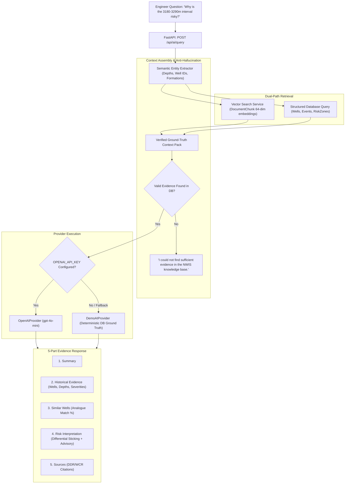

# eRTMAC-NWIS: System Architecture & Technical Design

This document details the architectural blueprint of **eRTMAC-NWIS (Nearby Wells Intelligence System)** developed for Oil India Limited operations.

---

## 1. System Architecture Overview

```mermaid
flowchart TB
    subgraph Client["Presentation Layer (React 19 + TypeScript + Arcadia Theme)"]
        UI_Nav["Command Header & Sim Controls"]
        UI_Dash["Operations Cockpit & Telemetry"]
        UI_Map["GIS Offset Well Explorer (Leaflet)"]
        UI_Sim["Similarity Matrix & Factors"]
        UI_Graph["Drilling Memory Graph (ForceGraph2D)"]
        UI_AI["Ask NWIS Assistant (5-Part Citations)"]
        UI_Admin["RBAC & Audit Trail Admin Console"]
    end

    subgraph Gateway["API & Security Layer (FastAPI)"]
        AuthMiddleware["JWT Authentication & RBAC Guard"]
        AuditService["Operational Audit Logger"]
        RouterHub["Modular Domain Routers"]
    end

    subgraph Routers["FastAPI Domain Routers"]
        R_Dash["/api/dashboard"]
        R_Wells["/api/wells"]
        R_Sim["/api/similarity"]
        R_Events["/api/events"]
        R_Memory["/api/memory-graph"]
        R_AI["/api/ai"]
        R_Docs["/api/documents"]
        R_Alerts["/api/alerts"]
        R_Auth["/api/auth & /api/admin"]
    end

    subgraph Intelligence["Intelligence & Decision Engines"]
        SimEngine["Offset Similarity Engine (5-Factor Weighted)"]
        RiskEngine["Historical Risk Engine (Standard Blueprints)"]
        VectorSvc["Vector Similarity Search (Cosine on 64-dim)"]
        Assembler["Context Assembler (Anti-Hallucination)"]
        DualAI["AI Provider: OpenAI gpt-4o-mini | DemoAIProvider"]
    end

    subgraph Persistence["Data & Persistence Layer"]
        DB[(PostgreSQL / SQLite Fallback)]
        WellsTable["wells & well_logs"]
        EventsTable["well_events & documents"]
        ChunksTable["document_chunks (RAG embeddings)"]
        RiskTable["risk_zones & alerts"]
        AuthTable["users, roles, permissions, audit_logs"]
    end

    Client --> Gateway
    Gateway --> RouterHub
    RouterHub --> Routers
    Routers --> Intelligence
    Intelligence --> Persistence
```

---

## 2. "Ask NWIS" RAG Architecture

---

## 3. Offset Well Similarity Engine Formulation

The Offset Well Similarity Engine calculates deterministic similarity between the active well ($W_{ref}$) and offset wells ($W_{offset}$) using a 5-factor weighted algorithm:

$$\text{Similarity Score} = \sum_{i=1}^5 w_i \cdot S_i$$

### Factor Breakdown:
| Factor | Weight ($w_i$) | Description & Formulation |
|---|:---:|---|
| **Formation** | **30%** | Stratigraphic match (identical formation = 1.0; same group = 0.7; disparate lithology = 0.1). |
| **Depth** | **25%** | Vertical proximity: $S_{depth} = \max\left(0, 1 - \frac{|\text{TD}_{ref} - \text{TD}_{offset}|}{1500}\right)$. |
| **Distance** | **20%** | Haversine distance: $S_{dist} = \max\left(0, 1 - \frac{d}{d_{max}}\right)$ with $d_{max} = 30\text{ km}$. |
| **Trajectory** | **15%** | Wellbore profile alignment (Vertical vs Directional vs Horizontal). |
| **Parameters** | **10%** | Mud weight regime match: $S_{param} = \max\left(0, 1 - \frac{|\text{MW}_{ref} - \text{MW}_{offset}|}{3.0}\right)$. |

**Deterministic Benchmark for Active Well `OIL-X123`:**
- Top Analogue: **`OIL-X104` — 91% Similarity**
  - Formation: 96%
  - Depth: 91%
  - Distance: 88%
  - Trajectory: 82%
  - Parameters: 95%

---

## 4. Historical Risk Classification & Operational Disclaimers

The Risk Engine maps depth intervals into standard severity tiers based on historical incident density:
- **`LOW`**: Isolated NPT or surface equipment maintenance; no active wellbore loss.
- **`MEDIUM`**: Seepage losses or minor torque drag; manageable with operational conditioning.
- **`HIGH`**: Documented mud loss (>30 bbl/hr) or tight hole requiring chemical spotting pills.
- **`CRITICAL`**: Severe differential sticking, catastrophic circulation loss, or kick events with >16h NPT.

### Mandatory Non-Certainty Operational Disclaimer
To protect operational integrity and prevent false certainty:
> *"Advisory Notice: Historical patterns indicate heightened susceptibility based on offset well data, but do not guarantee downhole conditions. Real-time telemetry monitoring is required."*

---

## 5. Security Architecture & RBAC System

1. **Token Flow**:
   - Client authenticates via `/api/auth/login` (email + password).
   - Server validates credentials using `bcrypt` and issues an HS256-signed JWT token.
   - Client includes `Bearer <token>` in the `Authorization` header for protected endpoints.
2. **Permission Guard**:
   - Endpoints are protected with FastAPI dependency `require_permission("<resource>.<action>")`.
   - The user's role is checked against the database `RolePermission` matrix.
3. **Audit Trail**:
   - Every significant action (`LOGIN`, `AI_QUERY`, `ALERT_ACKNOWLEDGE`, `ROLE_UPDATE`, `USER_STATUS_CHANGE`) generates an immutable audit record in the `audit_logs` table.
